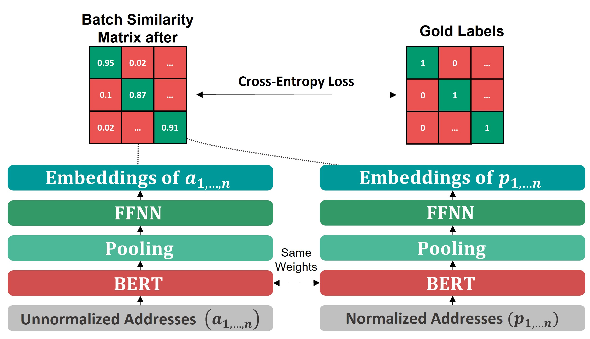
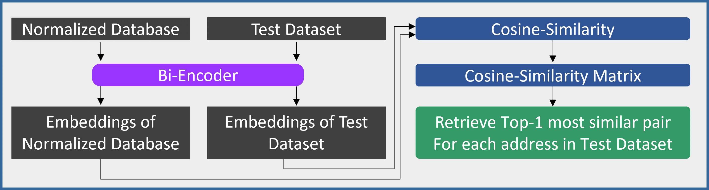

# ICMLA-2023

This is the official code accompanied with the paper 'Improving embeddings for high-accuracy transformer-based address matching using a multiple in-batch negatives loss'.  The paper is to be presented at ICMLA 2023.

  

Fig. 1: Fine-tuning architecture of bi-encoder for the address matching task model when using multiple negative ranking loss

 
 
 

  

Fig. 2: Architecture of the proposed model for evaluation on the test dataset.
